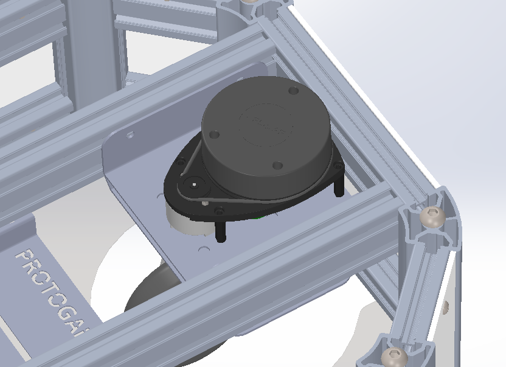

.. _RS PRO 11.1V Lithium-Ion Battery Pack: https://za.rs-online.com/web/p/rechargeable-battery-packs/1449414/?relevancy-data=7365617263685F636173636164655F6F726465723D31267365617263685F696E746572666163655F6E616D653D4931384E53656172636847656E65726963267365617263685F6C616E67756167655F757365643D656E267365617263685F6D617463685F6D6F64653D6D61746368616C6C7061727469616C267365617263685F7061747465726E5F6D6174636865643D5E2E2A24267365617263685F7061747465726E5F6F726465723D313333267365617263685F73745F6E6F726D616C697365643D59267365617263685F726573706F6E73655F616374696F6E3D267365617263685F747970653D43415443485F414C4C5F44454641554C54267365617263685F7370656C6C5F636F72726563745F6170706C6965643D59267365617263685F77696C645F63617264696E675F6D6F64653D4E4F4E45267365617263685F6B6579776F72643D42362062617474657279267365617263685F6B6579776F72645F6170703D42362062617474657279267365617263685F636F6E6669673D3026&searchHistory=%7B%22enabled%22%3Atrue%7D

.. _Pololu 5V, 5A Step-Down Voltage Regulator: https://www.pololu.com/product/2851

.. _here: https://www.basicmicro.com/Roboclaw-2x7A-Motor-Controller_p_55.html

.. _Slamtec RPLidar A1: https://www.slamtec.com/en/Lidar/A1

##################################
Getting Started with your Robot
##################################

The following documentation describes the basics of getting started with your new Pegasus-Mini. In terms of sensor variation, the possilitys are endless. 

The following is a list of recommended components required to getting started with your Pegasus-Mini.

   .. list-table:: 
      :widths: 50 50
      :header-rows: 0
      :align: center

      *  - Battery Pack
         - `RS PRO 11.1V Lithium-Ion Battery Pack`_
      *  - Voltage Regulator
         - `Pololu 5V, 5A Step-Down Voltage Regulator`_
      *  - Lidar Sensor
         - `Slamtec RPLidar A1`_

.. note::
    This documentation assumes that you have been through the :doc:`dissasembly_guide` in order to gain an understanding of how to open up your Pegesus-Mini and get started. 

1. Processing Unit 
+++++++++++++++++++

1.1. First things first, lets mount your main processing unit. The Pegasus-Mini was designed to be used with either a Jetson Nano or a Raspberry Pi and mounting has been provided according. Four standoffs have been provided. The followings shows the mounting for either processor on the electronics tray. Ensure that your processor is mounted with the USB ports pointed towards the front of your Robot. 

1.2. Depending on what battery you use, you may require a step down voltage regulator. Both the Jetson Nano and the Raspberry Pi require a fixed 5V input, with up to a max current draw of up to 3A. We recommend the `Pololu 5V, 5A Step-Down Voltage Regulator`_ with your Pegasus-Mini.

2. Battery 
++++++++++

You will need a battery with a voltage between 12-36V and a max continous power discharge of atleast 80W. The `RS PRO 11.1V Lithium-Ion Battery Pack`_ is the recommended battery.

3. Motor Controller
++++++++++++++++++++

The next step would be to get your motor controller ready. The Pegasus-Mini uses the Basicmicro Roboclaw 2x7A Motor Controller which is mount under the electronics tray. All documentation can be found `here`_. The following shows the hardware overview of the Motor Controller:

3.1. The motor controller requires an input of 12-36V. See :doc:`pegasusmini_base_wiring` for a wiring schematic in order to power your motor controller. 

3.2. Connect your motor controller to your processing unit using the Micro-USB to USB cable provided. 

4. LIDAR Sensor 
++++++++++++++++

In order to do mapping and navigation the Pegasus-Mini requires a lidar sensor. The Pegasus-Mini is designed to use the `Slamtec RPLidar A1`_. 

4.1. Mount you lidar sensor using the four M3 standoffs provided on the lidar mounting tray located infront of the electronics tray. The following images depicts the mounting:

4.2. Ensure that your Slamtec RPLidar A1 sensor to connected to your processing unit via Micro-USB to USB cable.

